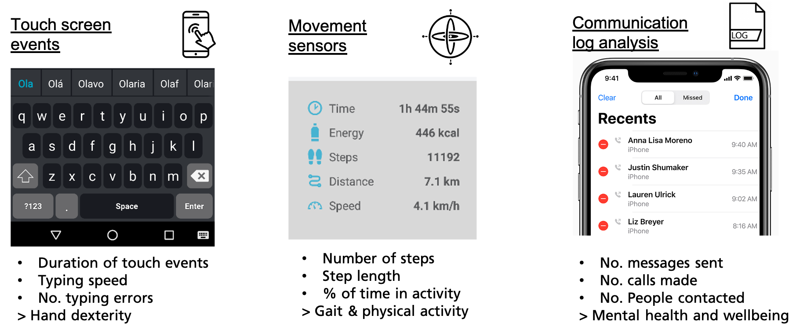
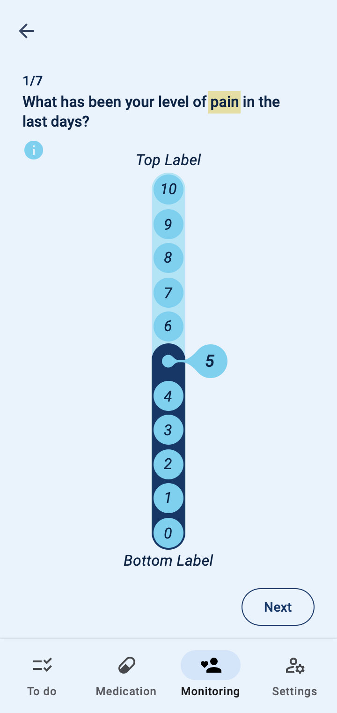
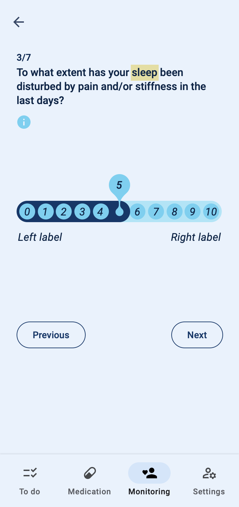
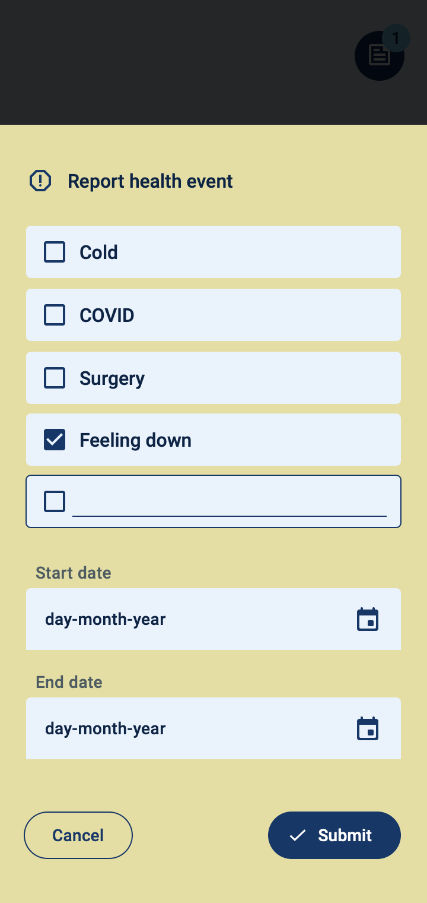

The COTIDIANA solution will enable holistic and efficient patient monitoring for clinical care, clinical research, and drug trials. It includes a mobile app, for patients, and a web app, for clinicians engaging in clinical care or clinical researchers working on drug trials. COTIDIANA solution is currently under development and is expected to be a medical device under commercialisation in 2024.  

`We are looking for volunteers to join our research. If you live in Portugal or Austria and have osteoarthritis, rheumatoid arthritis, psoriatic arthritis, or Sjögren syndrome, you may be able to participate in field trials or other research activities. Feel free to contact us.`   

## Objetive condition monitoring

The key selling point of the COTIDIANA solution is its ability to collect data about the patients' condition, without active intervention. The simple use of the smartphone will generate data about the patient's condition state that can be used to inform clinical encounters and contribute to care of clinical research.

The COTIDIANA solution will actively monitor:
* **Hand dexterity** using keyboard typing data, e.g., number of errors or typing speed, will enable clinicians to indirectly monitor increased pain in the hands or finger joint stiffness;
* **Mobility** using the smartphone accelerometer, will enable clinicians to track gait and physical activity which will provide more data about functional mobility or fatigue.
* **Mental health** using data from sociability patterns, e.g., number of made calls, SMS, and social media use, will document depression aggravation.   

## Mobile PROMs

The COTIDIANA solution also offers Patient-Reported Outcome Measures (PROMs). The product will feature some PROMs that apply to different rheumatic conditions and that were validated in usability tests with older adult patients. Clinicians will also be able to personalise the PROMs that patients see in their smartphone, according to the processes followed at their clinic or drug trial.  

	

		
	

	

		
	

	

		
	

 

## Patient monitoring at a distance

The COTIDIANA solution provides a dedicated platform for clinicians and clinical researchers to monitor patients. Using a simple interface, clinicians will be able to:
* Monitor patient symptoms;
* Personalize patient reported outcomes;
* Prepare electronic case report form, for clinical research or drug trials.